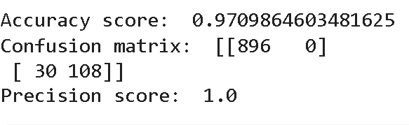

# SMS_Spam_Classifier

Deployed app link here:
https://smsspamclassifier-b5mmftrdw33lhotpcsbjlb.streamlit.app/

## 🚀 Overview

This project is an **SMS Spam Classification system** that uses machine learning to distinguish between **spam** and **ham (non-spam)** messages. It demonstrates practical NLP processing, feature extraction, model training, evaluation, and prediction using Python.

The classifier can be used to automatically filter spam messages, making it a useful tool for text preprocessing, message moderation, or as a learning project for applied machine learning.

## 🧩 Features

- Loads and preprocesses SMS data
- Text cleaning and tokenization
- Feature extraction using techniques like Bag of Words / TF-IDF
- Machine Learning models for classification
- Performance evaluation (accuracy, confusion matrix)
- Predicts whether a message is spam or ham

## 🧠 Model Selection

Multiple machine learning models were evaluated for SMS spam classification.
Among them, **Multinomial Naive Bayes (MNB) combined with TF-IDF embeddings**
provided the best overall performance in terms of accuracy and consistency.

This combination is particularly well-suited for text classification tasks
because:
- TF-IDF captures the importance of discriminative words
- Multinomial Naive Bayes works efficiently with sparse text features
- The model is fast, lightweight, and robust for short text messages

 

### 📸 Model Performance

 

Multinomial Naive Bayes with TF-IDF

## 🛠 Tech Stack

Built with:
- **Python** — Main programming language  
- **Pandas** — Data loading & manipulation  
- **Scikit-learn** — Machine learning models and evaluation  
- **NLTK** — Natural language processing utilities  
- **Matplotlib / Seaborn** — Visualization
- **Streamlit** - Web UI to enhance user experience  

## 🔮 Future Enhancements

- Use word embeddings (Word2Vec / GloVe / FastText) instead of TF-IDF.

- Deploy as a REST API using FastAPI for real-time classification.

- Add **cross-validation** to make model evaluation more robust and reduce
  dependency on a single train-test split.

## 👤 Author

-Adarsh Khetan

